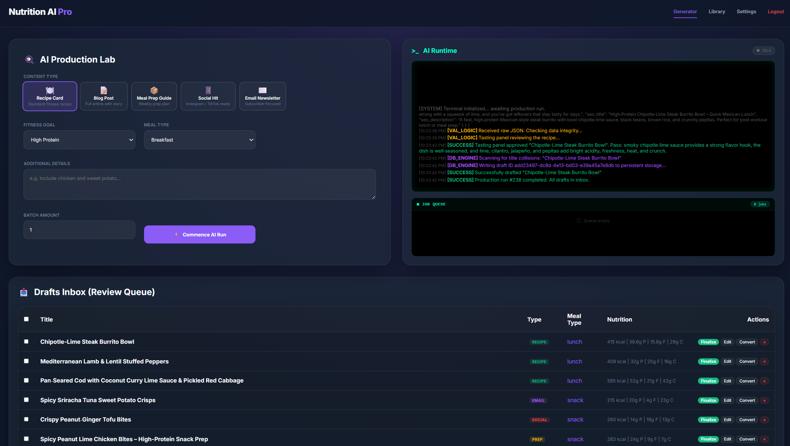

# Nutrition AI Pro

Nutrition AI Pro is an agentic AI recipe and nutrition-content production platform for fitness-focused teams.

It helps content teams move beyond one-shot prompting by combining structured recipe generation, iterative quality critique, human review, content conversion, prompt management, and operational controls in one self-hosted application.

Use it to produce recipe cards, blog posts, social assets, meal-prep guides, and email newsletter drafts with a reusable draft library and a human-in-the-loop workflow instead of disposable chat sessions.



## Start Here

| If you want to... | Go here |
| --- | --- |
| Install the app from released containers or source | [docs/INSTALLATION.md](docs/INSTALLATION.md) |
| Learn the day-to-day product workflow | [docs/USER_GUIDE.md](docs/USER_GUIDE.md) |
| Run the app in production | [docs/PRODUCTION.md](docs/PRODUCTION.md) |
| Troubleshoot Docker, auth, or AI provider issues | [docs/TROUBLESHOOTING.md](docs/TROUBLESHOOTING.md) |
| Understand backups and recovery | [docs/BACKUP_AND_RESTORE.md](docs/BACKUP_AND_RESTORE.md) |
| Plan upgrades and rollback expectations | [docs/UPGRADES.md](docs/UPGRADES.md) |
| Review security posture and reporting instructions | [SECURITY.md](SECURITY.md) |

## Why This App Is Different

Most AI recipe tools stop at "the model returned something."

Nutrition AI Pro turns that into a controlled production workflow:

- editors queue structured generation jobs instead of pasting ad hoc prompts
- the worker validates and critiques outputs before they land in Drafts
- teams review content in visual, structured, and raw JSON views
- approved drafts move into a reusable library instead of disappearing into chat history
- strong recipes can be converted into multiple downstream publishing formats

## Install Paths

| Path | Best for | Entry point |
| --- | --- | --- |
| Released container images | Normal self-hosted installs once the GitHub Container Registry package is public | `docker-compose.pull.yml` |
| Local source build | Development, validation, or fallback when the GHCR image is unavailable | `docker-compose.yml` |

The canonical published image path for this repository is `ghcr.io/drdeathlabs/nutrition_ai_pro`.

If `docker pull` returns `denied` or `not found`, verify the GitHub release workflow completed and the GitHub Packages visibility is public. Until then, use the source-build path.

## Agentic Content Engine

Nutrition AI Pro acts less like a prompt box and more like a production engine for recipe-centered content.

- The `Net-New Generation Path` drafts new content based on content type, fitness goal, meal type, and editorial direction.
- The worker validates returned structure before the output is accepted.
- A tastiness and quality critic pass reviews whether the draft is genuinely appealing, flavorful, and well-conceived.
- Failed drafts are retried with feedback from the rejected attempt before a user ever sees them.
- The `Recipe Conversion Path` takes an existing recipe and generates new wrapper formats like blog, social, or email content without replacing the underlying recipe.

The full product walkthrough, including the `Drafting step` and `Critique/tastiness step`, is documented in [docs/USER_GUIDE.md](docs/USER_GUIDE.md).

## Features

**Content Production**

- Recipe generation for `recipe_card`, `blog_post`, `meal_prep_guide`, `social_hit`, and `email_newsletter`
- Drafts Inbox for review, editing, approval, and conversion
- Finalized library with filtering, sorting, pagination, and bulk actions
- Conversion workflow for turning a proven recipe into additional content formats

**AI Workflow**

- Local Ollama plus Claude, OpenAI, and Gemini provider support
- Prompt registry for content-type prompts, critique prompts, and provider-role instructions
- Iterative draft, validate, critique, and retry loop
- Variety steering to reduce repetitive ingredients, dish patterns, and narrative openings

**Editorial and Admin Controls**

- Role-based access for `admin`, `editor`, and `viewer`
- User management, password changes, session controls, and account management
- Provider configuration, prompt management, logs, stats, import/export, and generation defaults
- Backup/export and restore-oriented operator workflows

**Security and Operations**

- JWT auth with least-privilege RBAC
- Encrypted-at-rest hosted-provider API keys
- SSRF protections for Ollama URL handling
- Rate limiting, CSP, and hardened response headers
- Docker Compose deployment with PostgreSQL persistence, health checks, CI, SBOM generation, and image scanning

## User Roles

| Role | Primary use |
| --- | --- |
| `admin` | Configure providers, manage prompts and users, review logs and data tools, and operate the platform |
| `editor` | Queue AI jobs, review drafts, edit content, finalize recipes, and run conversion workflows |
| `viewer` | Review approved content and browse the content library without changing system configuration |

## Typical Workflow

For the detailed product manual, see [docs/USER_GUIDE.md](docs/USER_GUIDE.md).

1. Sign in with an `editor` or `admin` account.
2. Queue a generation job for a recipe card or another supported content type.
3. Watch the `AI Runtime` and job queue while the worker drafts, validates, critiques, and retries if needed.
4. Review the resulting draft in Drafts using the visual, structured, or raw JSON view.
5. Edit or approve the draft and move it into the final library.
6. Convert strong recipes into blog, social, or email variants when you need downstream content.

## Quick Start

For complete setup options, see [docs/INSTALLATION.md](docs/INSTALLATION.md).

### Prerequisites

- Docker Desktop on Windows/macOS, or Docker Engine on Linux
- one supported AI provider:
  - Ollama
  - Claude
  - OpenAI
  - Gemini
- Node.js 20+ only if developing outside Docker

### 1. Configure environment

Copy the example environment file and replace all placeholder values:

```bash
cp .env.example .env
```

Important production values:

- `POSTGRES_PASSWORD`
- `ADMIN_PASSWORD`
- `JWT_SECRET`
- `SETTINGS_ENCRYPTION_KEY`
- `ALLOWED_ORIGINS`
- `INITIAL_ADMIN_USERNAME`

### 2. Start the stack

Use the prebuilt image from GitHub Container Registry when available:

```bash
docker compose -f docker-compose.pull.yml pull
docker compose -f docker-compose.pull.yml up -d
```

Or build locally from source:

```bash
docker compose up -d --build
```

By default, the app binds to:

- `http://localhost:8080`

PostgreSQL binds only to loopback by default:

- `127.0.0.1:5433`

### 3. Validate the install

Confirm the health endpoint:

```bash
curl http://localhost:8080/healthz
```

Expected result:

```json
{"ok":true,"dbReady":true}
```

### 4. Open the app

Open [http://localhost:8080](http://localhost:8080) and sign in with:

- `INITIAL_ADMIN_USERNAME`
- `ADMIN_PASSWORD`

Then configure an AI provider and run the in-app AI health check before starting real generation jobs.

## Security Posture

Nutrition AI Pro is designed for self-hosted deployment, including serious internal use, but operators still own their hosting environment, reverse proxy, TLS, backups, monitoring, and provider-account security.

Current hardening includes:

- bcrypt password hashing
- bootstrap-only env credential fallback after DB users exist
- admin-only operational endpoints for settings, prompts, logs, exports, imports, and stats
- AES-256-GCM encryption for external provider secrets at rest
- rate limiting for login, API use, and job creation
- `helmet` headers and CSP
- loopback-only default PostgreSQL binding
- app and database health checks

Known residual risks and deployment requirements are documented in [SECURITY.md](SECURITY.md) and [docs/PRODUCTION.md](docs/PRODUCTION.md). The latest release-hardening notes are in [docs/RELEASE_SECURITY_REVIEW.md](docs/RELEASE_SECURITY_REVIEW.md).

## Use Cases

- internal recipe and meal-content production for fitness brands
- editorial pipelines for nutrition coaches and meal-planning teams
- multi-format content generation from a single approved recipe
- local or private AI-assisted recipe development with Ollama
- prompt-tuned recipe testing and content experimentation
- internal publishing workflows that need reviewable structured outputs instead of chat transcripts

Internal organizational use is permitted by the source-available license. Hosted service, resale, white-labeling, and paid third-party service delivery require separate permission.

## AI Safety Notes

- Review AI-generated content before publication. The quality gate improves output, but it does not replace human editorial judgment.
- Do not submit secrets, regulated personal data, or sensitive business data to hosted AI providers unless your organization has approved that workflow.
- Use Ollama or another approved private model endpoint when local or private inference is required.
- Treat prompt changes as production configuration changes, not one-off campaign edits.

## Development

Install dependencies:

```bash
npm install
```

Frontend:

```bash
npm run dev
```

Backend:

```bash
node server/index.js
```

If the backend talks directly to the Dockerized Postgres on the host, use:

- `POSTGRES_HOST=localhost`
- `POSTGRES_PORT=5433`

## Testing

Useful checks:

```bash
npm run lint
npm test
npm run build
npm run test:e2e
```

`npm run test:e2e` expects a running app at `http://localhost:8080`.

## Project Structure

```text
Nutrition_AI_Pro/
  components/            Frontend rendering modules
  docs/                  User, install, production, and release docs
  e2e/                   Playwright end-to-end coverage
  server/                Express API, auth, worker, and persistence logic
  test/                  Unit and route tests
  docker-compose.yml     Self-hosted Docker stack built from local source
  docker-compose.pull.yml Self-hosted Docker stack using GHCR images
  SECURITY.md            Security policy and hardening notes
  LICENSE                Business Source License 1.1
```

## Container Images

Prebuilt images are intended to publish to GitHub Container Registry at:

- `ghcr.io/drdeathlabs/nutrition_ai_pro:latest`

The `latest` tag is the normal release install path. Version tags and SHA-based tags are produced by the release workflow.

If `docker pull` reports an authorization error after release publishing should exist, check the repository Packages page in GitHub and confirm the package is public.

## Documentation

**For users**

- [User Guide](docs/USER_GUIDE.md)

**For operators**

- [Installation Guide](docs/INSTALLATION.md)
- [Production Runbook](docs/PRODUCTION.md)
- [Troubleshooting](docs/TROUBLESHOOTING.md)
- [Backup and Restore](docs/BACKUP_AND_RESTORE.md)
- [Upgrades](docs/UPGRADES.md)
- [Security Policy](SECURITY.md)
- [Commercial Use Terms](COMMERCIAL.md)

**For contributors**

- [Contributing](CONTRIBUTING.md)
- [Support](SUPPORT.md)

## GitHub Safety Notes

Do not commit:

- `.env`
- real API keys
- Docker volumes
- local logs
- `node_modules`

The included `.gitignore` and `.dockerignore` are set up for these defaults, but always inspect `git status` before pushing.

## Secret Handling

The Docker Compose stack reads secrets from `.env` and passes them into containers as environment variables. This is common for self-hosted Docker Compose deployments, but it is not the same thing as an encrypted external secret store.

Hosted-provider API keys are encrypted at rest in the application database, but the original environment file on the host still needs normal operator care. Keep `.env` private, use long random values, and restrict host access to the deployment directory and Docker runtime.

## License

Nutrition AI Pro is source-available under the Business Source License 1.1.

The public license allows internal use by organizations, including commercial organizations, for their own recipe development, editorial workflows, evaluation, development, testing, education, and research.

You may not offer Nutrition AI Pro as a hosted service, managed service, SaaS product, paid commercial offering, white-labeled product, material feature of another commercial tool, or paid service-delivery platform unless you have separate written permission from the maintainer.

See [LICENSE](LICENSE) and [COMMERCIAL.md](COMMERCIAL.md). Because the license restricts some production and commercial uses before the Change Date, this project is not open source under the OSI Open Source Definition. Each specific version changes to the MIT License four years after that version is first publicly distributed.

## Support

See [SUPPORT.md](SUPPORT.md) for support boundaries and what to include in a support request. Security issues should follow [SECURITY.md](SECURITY.md), not public issue reporting.
