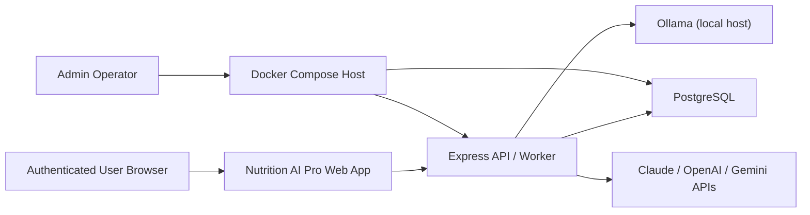

# Boundary Diagram

## Notes

- The browser talks only to the app origin.
- The Express app is the enforcement point for authentication, RBAC, validation, and provider integration.
- PostgreSQL is intended to remain loopback-only on the host by default.
- Ollama access is limited to an allowlisted set of hosts and ports.
- Hosted AI providers are outbound dependencies, not inbound components.
