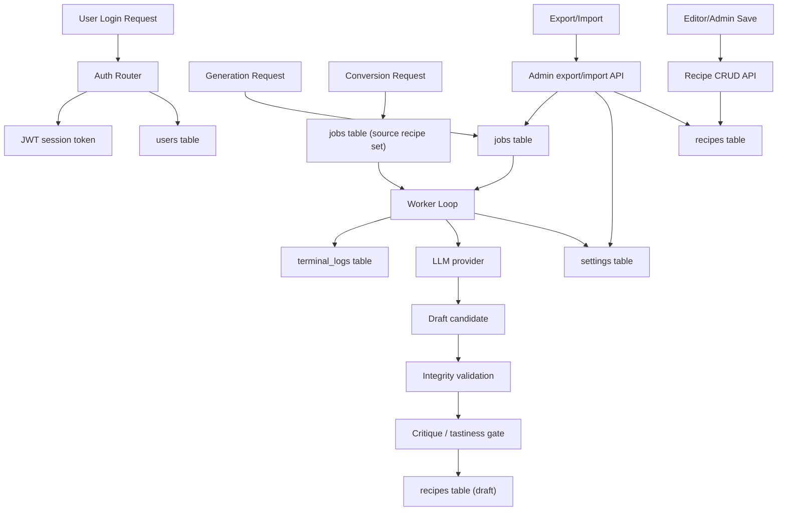

# Data Flow Diagram

## Notes

- Authentication flows through the `users` table after bootstrap.
- Sensitive provider API keys are decrypted only inside the server process when needed.
- Net-new generation is iterative: the app drafts, validates, critiques, and retries before a user sees a draft.
- Conversion jobs reuse an existing recipe and ask the AI to create a new wrapper format such as blog, social, or email content.
- Generation jobs, prompts, settings, logs, and content all persist in PostgreSQL.
- Export intentionally excludes plaintext secret material.
